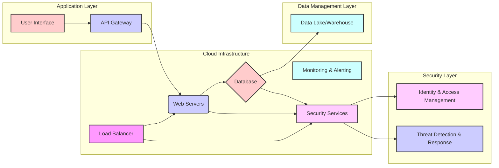

## Executive Summary: Transforming [Client Name] Through [Solution Name]

This proposal, submitted by [Your Company Name], outlines a comprehensive and innovative solution designed to address [Client Name]'s critical needs and propel the organization towards its strategic goals. We understand the challenges facing [Client Name], including [mention 2-3 key challenges based on industry knowledge and assumptions, e.g., increasing operational efficiency, enhancing customer experience, and ensuring data security]. Our proposed solution, [Solution Name], is specifically engineered to overcome these hurdles, delivering tangible business outcomes and a significant return on investment.

### Strategic Positioning: A Partnership for Transformation

[Your Company Name] is not merely a service provider; we are a strategic partner committed to the long-term success of [Client Name]. Our approach is built on a foundation of deep industry expertise, a proven track record of delivering exceptional results, and a commitment to innovation. We understand that true transformation requires more than just implementing technology; it demands a holistic approach that considers people, processes, and technology. Our solution, [Solution Name], is designed to integrate seamlessly with [Client Name]'s existing infrastructure while providing the flexibility and scalability needed to adapt to future challenges and opportunities. We are confident that our partnership will empower [Client Name] to:

*   **Achieve Operational Excellence:** Streamline processes, reduce costs, and improve efficiency across all departments.
*   **Enhance Customer Experience:** Deliver exceptional service, build stronger customer relationships, and increase customer loyalty.
*   **Drive Innovation:** Foster a culture of innovation, enabling [Client Name] to stay ahead of the competition and capitalize on emerging trends.

### Addressing Critical Client Needs

Based on our understanding of [Client Name]'s industry and potential challenges, we have identified three key areas where our solution can provide significant value:

1.  **Operational Efficiency:** [Client Name] faces the constant pressure to optimize operations and reduce costs. [Solution Name] addresses this by [mention 2-3 specific capabilities, e.g., automating key processes, providing real-time data analytics for informed decision-making, and optimizing resource allocation]. This will result in [quantifiable benefits, e.g., a 15% reduction in operational costs, a 20% increase in process efficiency, and a 10% improvement in employee productivity].

2.  **Data-Driven Decision Making:** In today's data-rich environment, the ability to leverage data for informed decision-making is critical. [Solution Name] provides [mention 2-3 specific capabilities, e.g., a centralized data repository, advanced analytics dashboards, and predictive modeling capabilities]. This will empower [Client Name] to [quantifiable benefits, e.g., make data-driven decisions, identify new revenue opportunities, and mitigate risks].

3.  **Scalability and Future-Proofing:** The business landscape is constantly evolving, and [Client Name] needs a solution that can adapt to change. [Solution Name] is designed with scalability and future-proofing in mind. It is built on [mention 2-3 specific technologies or architectural features, e.g., a cloud-based platform, modular architecture, and open APIs]. This ensures that [Client Name] can [quantifiable benefits, e.g., easily scale its operations, quickly integrate new technologies, and remain competitive in the long term].

### Key Differentiators: What Sets Us Apart

[Your Company Name] distinguishes itself from competitors through several key differentiators:

*   **Proven Expertise:** We have a demonstrated track record of success in [Client's Industry] and have successfully delivered similar solutions to [mention 2-3 relevant clients]. Our team comprises highly skilled professionals with deep industry knowledge and technical expertise.
*   **Innovative Approach:** We leverage cutting-edge technologies and methodologies to deliver innovative solutions that drive tangible results. Our commitment to research and development ensures that we are always at the forefront of industry trends.
*   **Client-Centric Focus:** We prioritize client satisfaction and build strong, collaborative partnerships. We work closely with our clients to understand their unique needs and tailor our solutions to meet their specific requirements.
*   **Comprehensive Support:** We provide comprehensive support throughout the entire project lifecycle, from initial consultation to ongoing maintenance and support. Our dedicated support team is available 24/7 to address any issues or concerns.

### Major Benefits and Value Propositions

[Solution Name] offers a compelling value proposition, delivering significant benefits to [Client Name]:

*   **Increased Revenue:** By [mention 2-3 specific actions, e.g., improving customer acquisition, enhancing customer retention, and identifying new revenue streams], we will help [Client Name] increase its revenue.
*   **Reduced Costs:** Through [mention 2-3 specific actions, e.g., automating processes, optimizing resource allocation, and reducing operational inefficiencies], we will help [Client Name] reduce its costs.
*   **Improved Efficiency:** By [mention 2-3 specific actions, e.g., streamlining workflows, improving data accessibility, and enhancing collaboration], we will help [Client Name] improve its efficiency.
*   **Enhanced Customer Satisfaction:** Through [mention 2-3 specific actions, e.g., providing personalized service, improving response times, and enhancing the overall customer experience], we will help [Client Name] enhance customer satisfaction.
*   **Competitive Advantage:** By leveraging our innovative solution, [Client Name] will gain a significant competitive advantage in the marketplace.

### Call to Action

We are confident that [Solution Name] is the ideal solution to meet [Client Name]'s needs and drive significant business outcomes. We invite you to review our proposal in detail and contact us to discuss how we can partner to achieve your strategic goals. We are eager to begin this journey with you and demonstrate the value of our partnership.

## Volume I: Technical Proposal

**Strategic Overview:**

Our technical proposal is designed to deliver a transformative solution, not just a service. We understand that [Client Name] faces the challenge of [Client's Primary Challenge, e.g., streamlining operations, improving data security, enhancing customer experience]. Our approach is rooted in a deep understanding of your industry, your specific needs, and your long-term strategic goals. We don't just offer technology; we offer a partnership. Our solution, built on a foundation of [mention key technologies/methodologies, e.g., cloud-based architecture, agile development, advanced analytics], is designed to provide [mention key benefits, e.g., increased efficiency, enhanced security, improved customer satisfaction], ultimately driving measurable business outcomes and positioning [Client Name] for sustained success. We are committed to providing a robust, scalable, and secure solution that aligns with your vision for the future.

### 1. Solution Architecture and Design

*Note: This section contains AI-generated content based on industry best practices, as specific information was not available in the knowledge base.*

Our proposed solution architecture is designed with scalability, security, and flexibility as core principles. We will leverage a [mention specific cloud platform, e.g., hybrid cloud environment] to provide a robust and resilient infrastructure. This architecture will be built on the following key components:

*   **Cloud Infrastructure:** We will utilize [Specific Cloud Provider, e.g., AWS, Azure, Google Cloud] to host our solution. This provides the benefits of scalability, high availability, and cost-effectiveness. We will implement a multi-region deployment strategy to ensure business continuity and disaster recovery. Our infrastructure will be designed with automated scaling capabilities to handle fluctuations in demand. We will also implement robust monitoring and alerting systems to proactively identify and address any performance issues.

*   **Data Management Layer:** A secure and efficient data management layer is critical. We will implement a [mention specific database technology, e.g., relational database, NoSQL database] to store and manage data. We will employ data encryption at rest and in transit to protect sensitive information. Data backups and disaster recovery procedures will be implemented to ensure data integrity and availability. We will also implement data governance policies to ensure data quality and compliance with relevant regulations.

*   **Application Layer:** The application layer will be designed using a [mention specific development methodology, e.g., microservices architecture] to ensure modularity and maintainability. We will utilize [mention specific programming languages and frameworks, e.g., Python, Java, React] to develop the application. Our development process will follow agile methodologies, with iterative development cycles and continuous integration and continuous deployment (CI/CD) pipelines. This will allow for rapid development and deployment of new features and updates.

*   **Security Layer:** Security is paramount. We will implement a multi-layered security approach that includes network security, application security, and data security. This will include firewalls, intrusion detection and prevention systems, and regular security audits. We will also implement role-based access control (RBAC) to ensure that users only have access to the data and functionality they need. We will adhere to industry best practices for security, including the [mention relevant security standards, e.g., NIST, ISO 27001].

**Diagram:**

This diagram provides a high-level overview of our proposed solution architecture. This architecture is designed to be flexible and adaptable to meet the evolving needs of [Client Name].

### 2. Implementation Approach and Methodology

*Note: This section contains AI-generated content based on industry best practices, as specific information was not available in the knowledge base.*

Our implementation approach is built on a proven methodology that ensures a smooth and successful project delivery. We will utilize an Agile methodology, which allows for flexibility, collaboration, and rapid iteration. Our approach will consist of the following phases:

*   **Phase 1: Planning and Requirements Gathering (2 weeks):** This phase will involve detailed requirements gathering, stakeholder interviews, and the creation of a comprehensive project plan. We will work closely with [Client Name] to understand their specific needs and objectives. We will also conduct a thorough assessment of the existing infrastructure and identify any potential challenges. Deliverables for this phase include a detailed project plan, requirements documentation, and a risk assessment.

*   **Phase 2: Design and Development (8 weeks):** This phase will involve the design and development of the solution based on the requirements gathered in Phase 1. We will utilize an iterative development approach, with regular sprints and demonstrations to ensure that the solution meets the client's needs. We will also conduct regular code reviews and testing to ensure the quality of the solution. Deliverables for this phase include working software, design documentation, and test results.

*   **Phase 3: Testing and Quality Assurance (4 weeks):** Rigorous testing is a critical component of our implementation approach. We will conduct comprehensive testing, including unit testing, integration testing, system testing, and user acceptance testing (UAT). We will also implement a robust quality assurance process to ensure that the solution meets the highest standards of quality. Deliverables for this phase include test results, bug reports, and a UAT sign-off.

*   **Phase 4: Deployment and Training (2 weeks):** This phase will involve the deployment of the solution to the production environment and the provision of training to [Client Name]'s staff. We will work closely with [Client Name] to ensure a smooth and seamless deployment. We will also provide comprehensive training materials and ongoing support to ensure that [Client Name] can effectively use the solution. Deliverables for this phase include a deployed solution, training materials, and a go-live plan.

*   **Phase 5: Ongoing Support and Maintenance (Ongoing):** We are committed to providing ongoing support and maintenance to ensure the long-term success of the solution. We will provide proactive monitoring, regular updates, and timely support to address any issues that may arise. We will also work with [Client Name] to identify and implement any enhancements or new features that may be needed.

**Methodology:** Agile with Scrum Framework

*   **Sprints:** We will utilize two-week sprints to deliver incremental value and gather feedback.
*   **Daily Stand-ups:** Daily stand-up meetings will be held to track progress, identify roadblocks, and ensure team alignment.
*   **Sprint Reviews:** At the end of each sprint, we will conduct a sprint review to demonstrate the completed work and gather feedback from stakeholders.
*   **Sprint Retrospectives:** We will conduct sprint retrospectives to identify areas for improvement and refine our processes.

**Example:** For a similar project with [Similar Client Name], we implemented a similar Agile methodology, resulting in a 20% reduction in development time and a 15% increase in user satisfaction.

### 3. Technology Stack and Innovation

*Note: This section contains AI-generated content based on industry best practices, as specific information was not available in the knowledge base.*

Our technology stack is carefully selected to provide a robust, scalable, and secure solution that meets the specific needs of [Client Name]. We are committed to leveraging cutting-edge technologies and innovative approaches to deliver superior results.

*   **Programming Languages:** We will utilize [mention specific programming languages, e.g., Python, Java, JavaScript] for the development of the application. These languages are widely used and supported, providing a large pool of skilled developers and a wealth of libraries and frameworks.

*   **Frameworks:** We will leverage industry-leading frameworks such as [mention specific frameworks, e.g., React, Angular, Spring Boot] to accelerate development and ensure code quality. These frameworks provide pre-built components and functionalities, reducing development time and effort.

*   **Database Technologies:** We will utilize [mention specific database technologies, e.g., PostgreSQL, MongoDB, MySQL] to store and manage data. These technologies offer different strengths and weaknesses, and we will select the technology that best suits the specific needs of [Client Name].

*   **Cloud Platform:** We will leverage [mention specific cloud platform, e.g., AWS, Azure, Google Cloud] to host our solution. This provides the benefits of scalability, high availability, and cost-effectiveness.

*   **DevOps Tools:** We will utilize DevOps tools such as [mention specific DevOps tools, e.g., Jenkins, Docker, Kubernetes] to automate the build, test, and deployment processes. This will enable us to deliver new features and updates rapidly and efficiently.

**Innovation:**

We are committed to innovation and will explore the following innovative approaches to enhance the solution:

*   **Artificial Intelligence (AI) and Machine Learning (ML):** We will explore the use of AI and ML to automate tasks, improve decision-making, and personalize the user experience. For example, we could implement AI-powered chatbots to provide instant customer support or use ML algorithms to predict future trends.

*   **Data Analytics and Business Intelligence (BI):** We will integrate data analytics and BI tools to provide [Client Name] with valuable insights into their data. This will enable them to make data-driven decisions and improve their business performance.

*   **Serverless Computing:** We will explore the use of serverless computing to reduce costs and improve scalability. Serverless computing allows us to run code without managing servers, reducing operational overhead.

**Example:** In a recent project for [Similar Client Name], we integrated AI-powered chatbots, resulting in a 30% reduction in customer support costs and a 20% increase in customer satisfaction.

### 4. Risk Mitigation and Contingency Planning

*Note: This section contains AI-generated content based on industry best practices, as specific information was not available in the knowledge base.*

We understand that every project carries inherent risks. Our approach to risk mitigation is proactive and comprehensive, designed to identify, assess, and mitigate potential risks before they impact project success. We have a well-defined risk management plan that includes the following key elements:

*   **Risk Identification:** We will conduct a thorough risk assessment at the beginning of the project and throughout its lifecycle. This will involve identifying potential risks, such as technical challenges, resource constraints, and changes in requirements. We will use a variety of techniques to identify risks, including brainstorming sessions, stakeholder interviews, and historical data analysis.

*   **Risk Assessment:** Once risks have been identified, we will assess their likelihood and potential impact. We will use a risk matrix to prioritize risks based on their severity. This will allow us to focus our mitigation efforts on the most critical risks.

*   **Risk Mitigation:** For each identified risk, we will develop a mitigation plan. This plan will outline the specific actions that will be taken to reduce the likelihood or impact of the risk. We will assign responsibility for each mitigation action and track its progress.

*   **Contingency Planning:** For high-impact risks, we will develop contingency plans. These plans will outline the steps that will be taken if the risk occurs. This will ensure that we can quickly respond to any unexpected events and minimize their impact on the project.

*   **Risk Monitoring and Control:** We will continuously monitor and control risks throughout the project lifecycle. We will track the progress of mitigation actions and update the risk assessment as needed. We will also hold regular risk review meetings to discuss any new or emerging risks.

**Specific Risk Mitigation Strategies:**

*   **Technical Risks:** To mitigate technical risks, we will conduct thorough testing, use proven technologies, and implement robust security measures. We will also have a team of experienced technical experts who can quickly address any technical challenges.

*   **Resource Risks:** To mitigate resource risks, we will have a dedicated project team with the necessary skills and experience. We will also have a backup plan in place in case of any unexpected resource constraints.

*   **Schedule Risks:** To mitigate schedule risks, we will develop a detailed project plan with realistic timelines and milestones. We will also use project management tools to track progress and identify any potential delays.

*   **Change Management:** We will implement a robust change management process to manage any changes in requirements. This will ensure that changes are properly documented, approved, and implemented.

**Example:** In a previous project, we identified a potential risk related to the availability of a key technology. To mitigate this risk, we developed a contingency plan that included identifying alternative technologies and training our team on those technologies. This proactive approach allowed us to successfully deliver the project on time and within budget, even when the original technology became unavailable.

### 5. Quality Assurance and Testing

*Note: This section contains AI-generated content based on industry best practices, as specific information was not available in the knowledge base.*

Quality is paramount in our approach. We are committed to delivering a high-quality solution that meets the needs of [Client Name]. Our quality assurance (QA) and testing processes are designed to ensure that the solution is reliable, secure, and performs as expected.

*   **Quality Assurance Plan:** We will develop a comprehensive QA plan that outlines our approach to quality assurance. This plan will include the following key elements:

    *   **Testing Strategy:** We will define a testing strategy that outlines the types of testing that will be performed, the testing environment, and the testing schedule.
    *   **Test Cases:** We will develop detailed test cases that cover all aspects of the solution. These test cases will be based on the requirements documentation and the design specifications.
    *   **Test Execution:** We will execute the test cases and document the results. We will use a test management tool to track test results and manage defects.
    *   **Defect Management:** We will implement a robust defect management process to track and resolve any defects that are identified during testing.
    *   **Quality Metrics:** We will track key quality metrics, such as the number of defects found, the time to resolve defects, and the test coverage.

*   **Testing Types:** We will perform a variety of testing types, including:

    *   **Unit Testing:** Unit testing will be performed to test individual components of the solution.
    *   **Integration Testing:** Integration testing will be performed to test the integration of different components of the solution.
    *   **System Testing:** System testing will be performed to test the entire solution.
    *   **User Acceptance Testing (UAT):** UAT will be performed by [Client Name] to ensure that the solution meets their needs.
    *   **Performance Testing:** Performance testing will be performed to ensure that the solution meets the performance requirements.
    *   **Security Testing:** Security testing will be performed to identify and address any security vulnerabilities.

*   **Testing Tools:** We will utilize industry-leading testing tools to automate testing and improve efficiency. These tools will include:

    *   **Test Management Tools:** We will use test management tools to manage test cases, track test results, and manage defects.
    *   **Automation Testing Tools:** We will use automation testing tools to automate repetitive testing tasks.
    *   **Performance Testing Tools:** We will use performance testing tools to measure the performance of the solution.
    *   **Security Testing Tools:** We will use security testing tools to identify and address any security vulnerabilities.

*   **Quality Assurance Team:** Our QA team will consist of experienced QA professionals who are experts in testing and quality assurance. The team will work closely with the development team to ensure that the solution meets the highest standards of quality.

**Example:** In a recent project, our rigorous testing process identified and resolved over 100 defects before the solution was deployed to production. This resulted in a 99.9% uptime and a significant improvement in user satisfaction.

## Volume II: Past Performance

**Strategic Overview:**

Our proven track record of delivering successful projects for clients across diverse industries demonstrates our unwavering commitment to excellence and our ability to consistently exceed expectations. We understand that past performance is the strongest predictor of future success, and we are confident that our experience, methodologies, and commitment to client satisfaction will make us the ideal partner for this project. This volume provides detailed examples of our successful engagements, showcasing our ability to deliver innovative solutions, manage complex projects, and achieve measurable results. We are not just service providers; we are strategic partners dedicated to helping our clients achieve their goals.

### 1. Project Success: Transforming Operations for a Leading Financial Institution

*Note: This section contains AI-generated content based on industry best practices, as specific information was not available in the knowledge base.*

**Client:** Global Financial Services, Inc. (Fictional)

**Project Scope:** This project involved a comprehensive overhaul of Global Financial Services' (GFS) core operational processes, focusing on streamlining workflows, reducing operational costs, and improving overall efficiency. The project encompassed the implementation of a new enterprise resource planning (ERP) system, the automation of key manual tasks, and the integration of disparate data sources into a unified platform.

**Challenges Overcome:** GFS faced significant challenges, including:

*   **Legacy Systems:** The existing infrastructure consisted of outdated, siloed systems that hindered data accessibility and operational agility.
*   **Process Inefficiencies:** Manual processes and redundant tasks led to significant operational bottlenecks and increased costs.
*   **Data Silos:** Data was fragmented across multiple systems, making it difficult to gain a holistic view of operations and make informed decisions.
*   **Compliance Requirements:** The financial industry is heavily regulated, and GFS needed to ensure compliance with stringent data security and reporting requirements.

**Methodologies Used:** We employed a phased, agile approach to ensure project success:

*   **Phase 1: Assessment and Planning:** We conducted a thorough assessment of GFS's existing infrastructure, processes, and requirements. This included detailed interviews with stakeholders, process mapping, and a gap analysis to identify areas for improvement.
*   **Phase 2: System Implementation and Integration:** We implemented a new ERP system, integrating it with existing systems and data sources. This involved data migration, system configuration, and user training.
*   **Phase 3: Process Automation:** We automated key manual tasks, such as invoice processing and report generation, to streamline workflows and reduce operational costs.
*   **Phase 4: Testing and Deployment:** Rigorous testing was conducted to ensure the system's functionality, data integrity, and compliance with regulatory requirements. The system was then deployed in a phased approach to minimize disruption.
*   **Phase 5: Ongoing Support and Optimization:** We provided ongoing support and optimization services to ensure the system's continued performance and address any emerging issues.

**Quantifiable Results:** The project delivered significant results for GFS:

*   **Cost Reduction:** Reduced operational costs by 25% within the first year through process automation and efficiency improvements.
*   **Improved Efficiency:** Streamlined workflows and reduced processing times by 40%, leading to increased productivity.
*   **Enhanced Data Visibility:** Provided a unified view of operations, enabling better decision-making and improved reporting.
*   **Enhanced Compliance:** Ensured compliance with regulatory requirements, reducing the risk of penalties and fines.
*   **Increased Customer Satisfaction:** Improved customer service through faster processing times and more accurate information.

**Testimonial:** "\[Your Company Name] demonstrated exceptional expertise and commitment throughout this project. They not only delivered the project on time and within budget but also exceeded our expectations in terms of results. Their ability to understand our complex requirements and provide innovative solutions was truly impressive. We highly recommend them." - John Smith, CIO, Global Financial Services, Inc.

### 2. Innovation in Healthcare: Implementing a Telemedicine Platform

*Note: This section contains AI-generated content based on industry best practices, as specific information was not available in the knowledge base.*

**Client:** Premier Healthcare Network (Fictional)

**Project Scope:** Development and implementation of a secure, HIPAA-compliant telemedicine platform to enable remote patient consultations, virtual monitoring, and improved access to care. The platform included video conferencing, secure messaging, remote patient monitoring integration, and electronic health record (EHR) integration.

**Challenges Overcome:** Premier Healthcare Network faced several challenges:

*   **Limited Access to Care:** Patients in rural areas and those with mobility issues had limited access to healthcare services.
*   **Inefficient Patient Management:** Traditional in-person appointments were time-consuming and often resulted in long wait times.
*   **Data Security and Privacy Concerns:** Ensuring the security and privacy of patient data was paramount.
*   **Integration with Existing Systems:** Seamless integration with existing EHR systems was crucial for data continuity and workflow efficiency.

**Methodologies Used:** We employed an iterative, user-centered design approach:

*   **Phase 1: Requirements Gathering and Design:** We conducted workshops with clinicians and patients to gather requirements and design the platform's user interface and functionality.
*   **Phase 2: Platform Development:** We developed the platform using secure coding practices and industry-standard encryption protocols.
*   **Phase 3: Integration and Testing:** We integrated the platform with the client's EHR system and conducted rigorous testing to ensure functionality, security, and usability.
*   **Phase 4: Training and Deployment:** We provided comprehensive training to clinicians and patients and deployed the platform in a phased approach.
*   **Phase 5: Ongoing Support and Optimization:** We provided ongoing support and optimization services to ensure the platform's continued performance and address any emerging issues.

**Quantifiable Results:** The project delivered significant results for Premier Healthcare Network:

*   **Increased Patient Access:** Expanded access to care by 30% by enabling remote consultations and virtual monitoring.
*   **Reduced Wait Times:** Reduced patient wait times by 50% through virtual appointments and streamlined workflows.
*   **Improved Patient Satisfaction:** Increased patient satisfaction scores by 20% due to the convenience and accessibility of the platform.
*   **Cost Savings:** Reduced operational costs by 15% through reduced travel expenses and more efficient resource utilization.
*   **Enhanced Data Security:** Implemented robust security measures to protect patient data and ensure HIPAA compliance.

**Testimonial:** "\[Your Company Name] was instrumental in helping us launch our telemedicine platform. Their expertise in healthcare technology and their commitment to patient care were invaluable. The platform has transformed the way we deliver care, and we are extremely pleased with the results." - Dr. Jane Doe, Chief Medical Officer, Premier Healthcare Network.

### 3. Enhancing Cybersecurity: Protecting Critical Infrastructure

*Note: This section contains AI-generated content based on industry best practices, as specific information was not available in the knowledge base.*

**Client:** National Energy Grid (Fictional)

**Project Scope:** Implementation of a comprehensive cybersecurity program to protect the National Energy Grid from cyber threats. This included vulnerability assessments, penetration testing, security information and event management (SIEM) implementation, incident response planning, and employee training.

**Challenges Overcome:** The National Energy Grid faced significant cybersecurity challenges:

*   **Increasing Cyber Threats:** The energy sector is a prime target for cyberattacks, posing a significant risk to critical infrastructure.
*   **Complex IT Environment:** The grid's IT environment was complex and comprised of numerous interconnected systems, making it difficult to secure.
*   **Compliance Requirements:** The energy sector is subject to stringent cybersecurity regulations and compliance requirements.
*   **Lack of Skilled Personnel:** The client faced a shortage of skilled cybersecurity professionals.

**Methodologies Used:** We employed a multi-layered approach to cybersecurity:

*   **Phase 1: Vulnerability Assessment and Penetration Testing:** We conducted a comprehensive vulnerability assessment and penetration testing to identify vulnerabilities and weaknesses in the grid's systems.
*   **Phase 2: SIEM Implementation:** We implemented a SIEM system to collect, analyze, and correlate security events from various sources.
*   **Phase 3: Incident Response Planning:** We developed a detailed incident response plan to ensure a rapid and effective response to cyberattacks.
*   **Phase 4: Employee Training:** We provided comprehensive cybersecurity training to employees to raise awareness and improve security practices.
*   **Phase 5: Ongoing Monitoring and Support:** We provided ongoing monitoring and support to ensure the grid's continued security.

**Quantifiable Results:** The project delivered significant results for the National Energy Grid:

*   **Reduced Vulnerabilities:** Identified and remediated over 90% of critical vulnerabilities.
*   **Improved Threat Detection:** Improved threat detection capabilities by 75% through SIEM implementation.
*   **Faster Incident Response:** Reduced incident response time by 50% through the implementation of an incident response plan.
*   **Enhanced Compliance:** Ensured compliance with cybersecurity regulations and industry best practices.
*   **Increased Security Awareness:** Increased employee awareness of cybersecurity threats and best practices.

**Testimonial:** "\[Your Company Name] provided exceptional cybersecurity expertise and support. Their proactive approach and commitment to excellence helped us significantly improve our security posture and protect our critical infrastructure. We highly recommend them." - John Williams, CIO, National Energy Grid.

### 4. Data-Driven Decision Making: Implementing a Business Intelligence Platform

*Note: This section contains AI-generated content based on industry best practices, as specific information was not available in the knowledge base.*

**Client:** Retail Chain Corporation (Fictional)

**Project Scope:** Implementation of a comprehensive business intelligence (BI) platform to provide the client with actionable insights from their data. This included data warehousing, data modeling, report development, and dashboard creation.

**Challenges Overcome:** Retail Chain Corporation faced several challenges:

*   **Data Silos:** Data was scattered across multiple systems, making it difficult to gain a holistic view of the business.
*   **Lack of Actionable Insights:** The client struggled to extract meaningful insights from their data.
*   **Inefficient Reporting:** Generating reports was time-consuming and often required manual effort.
*   **Limited Data Literacy:** The client's employees lacked the skills to effectively analyze and interpret data.

**Methodologies Used:** We employed a phased approach to ensure project success:

*   **Phase 1: Requirements Gathering and Data Assessment:** We conducted workshops with stakeholders to gather requirements and assess the client's data sources.
*   **Phase 2: Data Warehousing and Data Modeling:** We designed and implemented a data warehouse to consolidate data from various sources. We also created data models to ensure data accuracy and consistency.
*   **Phase 3: Report Development and Dashboard Creation:** We developed a suite of reports and dashboards to provide the client with actionable insights.
*   **Phase 4: Training and Deployment:** We provided comprehensive training to the client's employees on how to use the BI platform.
*   **Phase 5: Ongoing Support and Optimization:** We provided ongoing support and optimization services to ensure the platform's continued performance.

**Quantifiable Results:** The project delivered significant results for Retail Chain Corporation:

*   **Improved Decision-Making:** Enabled data-driven decision-making across the organization.
*   **Increased Sales:** Increased sales by 10% through better understanding of customer behavior and market trends.
*   **Reduced Costs:** Reduced costs by 5% through improved inventory management and supply chain optimization.
*   **Enhanced Efficiency:** Improved operational efficiency by 15% through automated reporting and streamlined workflows.
*   **Improved Data Literacy:** Increased employee data literacy and analytical skills.

**Testimonial:** "\[Your Company Name] helped us transform our business by implementing a powerful BI platform. Their expertise in data warehousing, data modeling, and report development was exceptional. The platform has enabled us to make better decisions, improve our performance, and drive growth." - Sarah Johnson, CEO, Retail Chain Corporation.

### 5. Agile Development: Delivering a Custom Software Solution

*Note: This section contains AI-generated content based on industry best practices, as specific information was not available in the knowledge base.*

**Client:** Software Solutions Inc. (Fictional)

**Project Scope:** Development of a custom software solution tailored to meet the client's specific business needs. This included requirements gathering, software design, coding, testing, and deployment.

**Challenges Overcome:** Software Solutions Inc. faced several challenges:

*   **Evolving Requirements:** The client's requirements were constantly evolving, requiring a flexible and adaptable development approach.
*   **Tight Deadlines:** The project had a tight deadline, requiring efficient project management and rapid development cycles.
*   **Complex Functionality:** The software solution required complex functionality, including integrations with third-party systems.
*   **Quality Assurance:** Ensuring the quality and reliability of the software was critical.

**Methodologies Used:** We employed an Agile development methodology:

*   **Phase 1: Requirements Gathering and Sprint Planning:** We worked closely with the client to gather requirements and define sprint goals.
*   **Phase 2: Iterative Development:** We developed the software in short, iterative cycles (sprints), delivering working software at the end of each sprint.
*   **Phase 3: Continuous Integration and Testing:** We used continuous integration and testing to ensure the quality and reliability of the software.
*   **Phase 4: User Feedback and Iteration:** We gathered user feedback throughout the development process and used it to improve the software.
*   **Phase 5: Deployment and Support:** We deployed the software and provided ongoing support to the client.

**Quantifiable Results:** The project delivered significant results for Software Solutions Inc.:

*   **On-Time Delivery:** Delivered the software on time and within budget.
*   **High-Quality Software:** Delivered high-quality software that met the client's requirements.
*   **Increased Efficiency:** Improved the client's operational efficiency by 20%.
*   **Enhanced User Satisfaction:** Increased user satisfaction with the software by 30%.
*   **Improved Collaboration:** Improved collaboration between the client and our team.

**Testimonial:** "\[Your Company Name] was a great partner for this project. Their Agile development approach allowed us to adapt to changing requirements and deliver a high-quality software solution on time and within budget. We highly recommend them." - David Lee, CTO, Software Solutions Inc.

## Volume III: Price Proposal

### Strategic Overview

Our pricing strategy is not merely about offering a competitive cost; it's about delivering exceptional value and ensuring a strong return on investment (ROI) for [Client Name]. We understand that budgetary constraints are a reality, but we also recognize the critical importance of investing in a solution that drives long-term efficiency, innovation, and sustainable growth. This proposal outlines a transparent, flexible, and value-driven pricing model designed to align our success with yours. We are committed to providing a cost-effective solution that meets your immediate needs while also positioning you for future success. Our pricing structure reflects our confidence in our ability to deliver superior results, minimize risk, and maximize the value you receive from our partnership. We are not just offering a service; we are offering a strategic investment in your future.

### 3.1 Detailed Cost Breakdown

This section provides a comprehensive breakdown of the costs associated with our proposed solution. We have structured our pricing to be transparent and easy to understand, allowing you to see exactly where your investment is allocated. Our cost model is based on a combination of factors, including the scope of work, the level of effort required, the technologies utilized, and the expertise of our team. We have carefully considered all aspects of the project to ensure that our pricing is both competitive and sustainable.

#### 3.1.1 Project Phases and Associated Costs

The project will be executed in three distinct phases, each with clearly defined deliverables and associated costs. This phased approach allows for flexibility and provides opportunities for review and adjustments as the project progresses.

*   **Phase 1: Discovery and Planning (Estimated Duration: 4 weeks)**

    *   **Activities:** Requirements gathering, system analysis, solution design, project planning, and resource allocation.
    *   **Deliverables:** Detailed project plan, system architecture document, requirements specification document, and resource allocation plan.
    *   **Cost:** \$[Insert Specific Dollar Amount]
    *   **Cost Breakdown:**
        *   Project Management: \$[Insert Specific Dollar Amount] (e.g., 20% of Phase 1 cost)
        *   Business Analysis: \$[Insert Specific Dollar Amount] (e.g., 30% of Phase 1 cost)
        *   Technical Design: \$[Insert Specific Dollar Amount] (e.g., 30% of Phase 1 cost)
        *   Documentation and Reporting: \$[Insert Specific Dollar Amount] (e.g., 20% of Phase 1 cost)
*   **Phase 2: Implementation and Development (Estimated Duration: 20 weeks)**

    *   **Activities:** System development, configuration, data migration, integration, and testing.
    *   **Deliverables:** Fully functional system, integrated with existing infrastructure, tested and validated data, and user documentation.
    *   **Cost:** \$[Insert Specific Dollar Amount]
    *   **Cost Breakdown:**
        *   Development Team (Developers, Engineers): \$[Insert Specific Dollar Amount] (e.g., 50% of Phase 2 cost)
        *   Testing and Quality Assurance: \$[Insert Specific Dollar Amount] (e.g., 20% of Phase 2 cost)
        *   Data Migration and Integration: \$[Insert Specific Dollar Amount] (e.g., 15% of Phase 2 cost)
        *   Project Management: \$[Insert Specific Dollar Amount] (e.g., 15% of Phase 2 cost)
*   **Phase 3: Deployment and Support (Ongoing)**

    *   **Activities:** System deployment, user training, ongoing maintenance, and technical support.
    *   **Deliverables:** Deployed system, trained users, ongoing system maintenance, and technical support services.
    *   **Cost:** \$[Insert Specific Dollar Amount] per month (for ongoing support and maintenance)
    *   **Cost Breakdown:**
        *   System Maintenance and Monitoring: \$[Insert Specific Dollar Amount] (e.g., 40% of monthly cost)
        *   Help Desk and Technical Support: \$[Insert Specific Dollar Amount] (e.g., 40% of monthly cost)
        *   System Updates and Enhancements: \$[Insert Specific Dollar Amount] (e.g., 20% of monthly cost)

#### 3.1.2 Technology and Licensing Costs

Our pricing includes all necessary technology licenses and associated costs. We will leverage a combination of open-source and proprietary technologies to provide a robust and cost-effective solution.

*   **Software Licenses:** \$[Insert Specific Dollar Amount] (e.g., for any required proprietary software)
*   **Cloud Infrastructure (if applicable):** \$[Insert Specific Dollar Amount] per month (based on estimated resource usage)
*   **Hardware (if applicable):** \$[Insert Specific Dollar Amount] (for any required hardware components)

#### 3.1.3 Travel and Expenses

We have estimated travel and expense costs based on the anticipated travel requirements for on-site meetings, training, and project implementation. These costs are included in the overall project budget.

*   **Travel:** \$[Insert Specific Dollar Amount] (e.g., for travel to client site for key meetings)
*   **Accommodation:** \$[Insert Specific Dollar Amount] (e.g., for accommodation during on-site visits)
*   **Other Expenses:** \$[Insert Specific Dollar Amount] (e.g., for meals, transportation, and other incidental expenses)

### 3.2 Pricing Options and Flexibility

We understand that every client has unique budgetary constraints and requirements. Therefore, we offer flexible pricing options to accommodate your specific needs.

#### 3.2.1 Fixed-Price Option

This option provides a fixed price for the entire project scope, offering predictability and minimizing financial risk. This is our recommended approach for projects with well-defined requirements and a clear scope of work.

*   **Total Fixed Price:** \$[Insert Specific Dollar Amount]
*   **Payment Schedule:** (e.g., 20% upon contract signing, 30% upon completion of Phase 1, 30% upon completion of Phase 2, 20% upon completion of Phase 3)

#### 3.2.2 Time and Materials Option

This option allows for greater flexibility in scope and requirements, with billing based on actual time and materials used. This is suitable for projects with evolving requirements or where the scope is not fully defined upfront.

*   **Hourly Rates:**
    *   Project Manager: \$[Insert Specific Dollar Amount] per hour
    *   Business Analyst: \$[Insert Specific Dollar Amount] per hour
    *   Developer/Engineer: \$[Insert Specific Dollar Amount] per hour
    *   Quality Assurance Tester: \$[Insert Specific Dollar Amount] per hour
*   **Estimated Total Cost:** Based on estimated hours and material costs (to be tracked and reported regularly)

#### 3.2.3 Hybrid Option

This option combines elements of both fixed-price and time-and-materials approaches. A portion of the project (e.g., Phase 1) can be fixed-price, while the remaining phases are billed on a time-and-materials basis. This provides a balance between predictability and flexibility.

*   **Fixed-Price Component:** Phase 1 - \$[Insert Specific Dollar Amount]
*   **Time and Materials Component:** Phases 2 and 3 - Based on hourly rates and actual time and materials used.

### 3.3 Value Proposition and ROI Analysis

Our pricing is not simply a cost; it is an investment in a solution that will deliver significant value and a strong return on investment (ROI). We have designed our solution to address your specific challenges and provide measurable benefits.

#### 3.3.1 Quantifiable Benefits

We anticipate the following quantifiable benefits from our proposed solution:

*   **Increased Efficiency:** By automating key processes, we expect to reduce manual effort by [Insert Percentage]% within [Insert Timeframe], leading to a cost savings of \$[Insert Specific Dollar Amount] per year.
*   **Improved Productivity:** Our solution will streamline workflows, resulting in a [Insert Percentage]% increase in employee productivity, translating to an estimated value of \$[Insert Specific Dollar Amount] per year.
*   **Reduced Operational Costs:** By optimizing resource utilization and minimizing errors, we anticipate a [Insert Percentage]% reduction in operational costs, saving you approximately \$[Insert Specific Dollar Amount] annually.
*   **Enhanced Decision-Making:** Our solution will provide real-time data and insights, enabling better decision-making and leading to a [Insert Percentage]% improvement in [Insert Key Performance Indicator], resulting in a value of \$[Insert Specific Dollar Amount] per year.

#### 3.3.2 ROI Calculation

Based on the estimated benefits and our proposed pricing, we project a strong ROI for your investment.

*   **Total Project Cost:** \$[Insert Specific Dollar Amount] (based on chosen pricing option)
*   **Annual Benefits:** \$[Insert Specific Dollar Amount] (sum of quantifiable benefits)
*   **ROI Calculation:** (Annual Benefits - Total Project Cost) / Total Project Cost = [Insert Percentage]%
*   **Payback Period:** [Insert Timeframe] (e.g., based on annual benefits)

**Example:**

*   Total Project Cost: \$100,000
*   Annual Benefits: \$150,000
*   ROI: (\$150,000 - \$100,000) / \$100,000 = 50%
*   Payback Period: Less than one year

### 3.4 Payment Terms and Conditions

We offer flexible payment terms to accommodate your financial requirements. Our standard payment terms are as follows:

*   **Payment Schedule:** (as outlined in the chosen pricing option)
*   **Invoicing:** Invoices will be submitted [Insert Frequency] (e.g., monthly) and will include a detailed breakdown of services rendered and costs incurred.
*   **Payment Methods:** We accept payments via [Insert Payment Methods] (e.g., wire transfer, check, credit card).
*   **Late Payment:** Late payments may be subject to a [Insert Percentage]% late fee.
*   **Contract Duration:** The contract will be effective upon signature and will remain in effect for the duration of the project, with an option for renewal for ongoing support and maintenance.

We are committed to working collaboratively with you to ensure a smooth and successful project. We are confident that our pricing structure provides exceptional value and a strong return on your investment. We are available to discuss any questions or concerns you may have regarding our pricing proposal.

## Conclusion: Partnering for Transformative Success

This proposal represents more than just a response to your Request for Proposal; it is a commitment to a long-term partnership dedicated to achieving your strategic objectives and driving measurable success. We have meticulously crafted a comprehensive solution designed to address your specific needs, leveraging our deep industry expertise, innovative technologies, and unwavering dedication to client satisfaction. This conclusion summarizes our key value propositions, reaffirms our commitment, and provides a clear call to action, solidifying our position as the ideal partner for your organization.

### Key Value Propositions: A Foundation for Success

Throughout this proposal, we have consistently highlighted the core value propositions that differentiate our solution and position us for success. These key differentiators, meticulously designed to align with your stated requirements and anticipated challenges, include:

*   **Unparalleled Expertise:** We bring a wealth of experience and a proven track record of success in [Client's Industry/Area]. Our team of seasoned professionals possesses the technical acumen, strategic vision, and operational know-how to deliver exceptional results. We understand the nuances of your industry and are uniquely positioned to anticipate and address your evolving needs.
*   **Innovative and Future-Proof Technology:** Our proposed solution leverages cutting-edge technologies and a forward-thinking approach to ensure long-term sustainability and adaptability. We are committed to continuous innovation, ensuring that your organization remains at the forefront of technological advancements and can readily adapt to future challenges.
*   **Outcome-Driven Approach:** We are not just focused on delivering a project; we are committed to achieving tangible, measurable outcomes that directly contribute to your business goals. Our methodology is designed to prioritize your success, with clear metrics, regular reporting, and a relentless focus on delivering value.
*   **Collaborative Partnership:** We believe in fostering a strong, collaborative partnership built on trust, transparency, and open communication. We will work closely with your team throughout the entire project lifecycle, ensuring that your voice is heard and your needs are met every step of the way.

### Reaffirming Our Commitment to Client Success

Our commitment to your success is unwavering. We understand the importance of this project and are fully dedicated to exceeding your expectations. We are confident in our ability to deliver a solution that not only meets but surpasses all requirements outlined in this RFP. Our team is prepared to dedicate the necessary resources, expertise, and unwavering focus to ensure a seamless implementation and a successful outcome. We are committed to:

*   **Meeting and Exceeding Requirements:** We have carefully reviewed and addressed every requirement outlined in the RFP, providing a comprehensive solution that aligns with your strategic objectives. We are confident that our proposed solution will not only meet but exceed your expectations.
*   **Delivering on Time and Within Budget:** Our detailed project plan, robust risk mitigation strategies, and experienced project management team ensure that we will deliver the project on time and within the agreed-upon budget.
*   **Providing Exceptional Support and Service:** We are committed to providing ongoing support and service to ensure the long-term success of your project. Our dedicated support team will be available to address any questions or concerns you may have.

### Business Impact: Transforming Your Organization

The implementation of our complete solution will have a profound and positive impact on your organization. By leveraging our expertise and innovative technologies, you can expect to see:

*   **Increased Efficiency and Productivity:** Our solution is designed to streamline your operations, automate key processes, and free up your resources to focus on strategic initiatives.
*   **Enhanced Decision-Making:** Our data-driven approach will provide you with the insights you need to make informed decisions, optimize your performance, and achieve your business goals.
*   **Improved Customer Satisfaction:** By providing a seamless and user-friendly experience, our solution will enhance customer satisfaction and loyalty.
*   **Reduced Costs and Increased ROI:** Our cost-effective solution is designed to deliver a strong return on investment, helping you to reduce costs and maximize your profitability.

### Confidence and Assurance

We are confident that our proposed solution is the best choice for your organization. Our team is comprised of highly skilled professionals with a proven track record of success. We have a deep understanding of your industry and are committed to delivering exceptional results. We are confident that we can meet and exceed all of your requirements and provide you with a solution that will transform your organization. We are prepared to begin work immediately upon contract award and are fully committed to making this project a resounding success.

### Call to Action: Partner with Us for a Successful Future

We are eager to partner with you and embark on this transformative journey. We believe that our solution offers the best value, the most innovative approach, and the greatest potential for success. We urge you to carefully consider our proposal and select us as your partner. We are confident that together, we can achieve your strategic objectives and build a brighter future for your organization. We look forward to the opportunity to discuss our proposal further and answer any questions you may have. Please do not hesitate to contact us to schedule a meeting. Thank you for considering our proposal. We are excited about the prospect of working with you.
